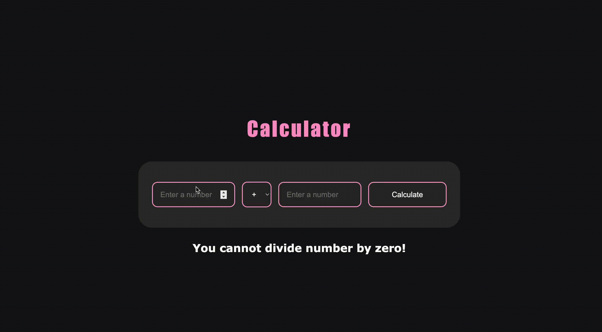

# 🧮 Simple PHP Calculator

A basic calculator made with PHP. The calculator takes two numbers and an operator, then calculates and displays the result. It shows an error message if you try to divide by zero. 

🛠️ Tech Stack
- PHP
- HTML 
- CSS

---

## 🚀 Preview

  

#### 🎬 [Watch Full Demo on YouTube Here!](https://www.youtube.com/watch?v=xv25Mg1D82U)

